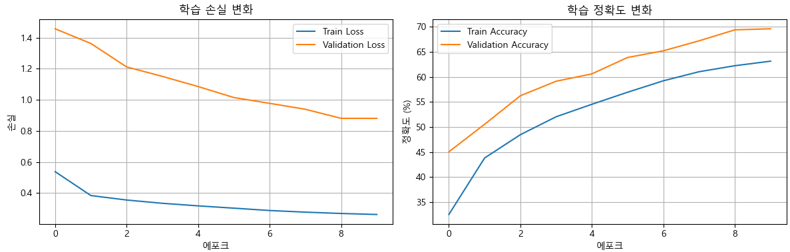
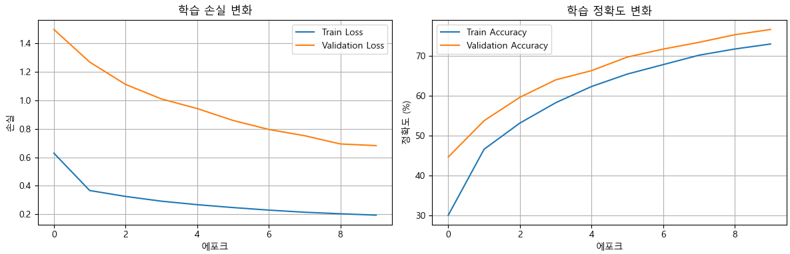
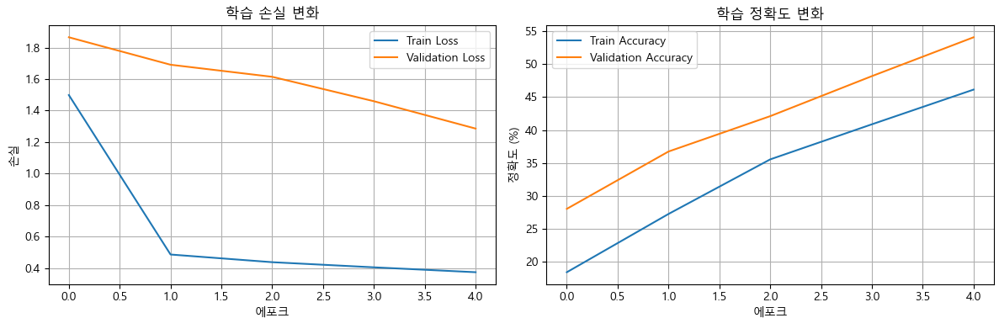

# pytorch exam

## Description
cifar10 dataset 학습 테스트

## File Tree
```bash
pytorch_exam/
│
├── data/ # 데이터 디렉토리
│   ├── train/ # 훈련 데이터 디렉토리
│   ├── test/ # 테스트 데이터 디렉토리
│   ├── dog.jpg # 예측할 이미지
│   └── cat.jpg # 예측할 이미지
│
├── models/ # 모델 관련 파일
│   └── convnet.py # ConvNet 모델 정의
│
├── cnn_mnist.py # 학습 스크립트
├── download_dataset.py # 학습 데이터 다운로드
└── predict.py # 예측 스크립트
```

## pytorch cuda version 12.1 설치
pip3 install torch torchvision torchaudio --index-url https://download.pytorch.org/whl/cu121

## 학습결과
### 1st test
- epochs 10
- batch 64
- learning rate 0.001
- layer2
- dropout CNN 0.5, FC 0.5


### 2nd test
- epochs 10
-  batch 128
- learning rate 0.001
- layer3
- dropout CNN 0.5, FC 0.5


### 3rd test
- epochs 5
- batch 32
- learning rate 0.01
- layer3
- dropout CNN 0.5, FC 0.5

